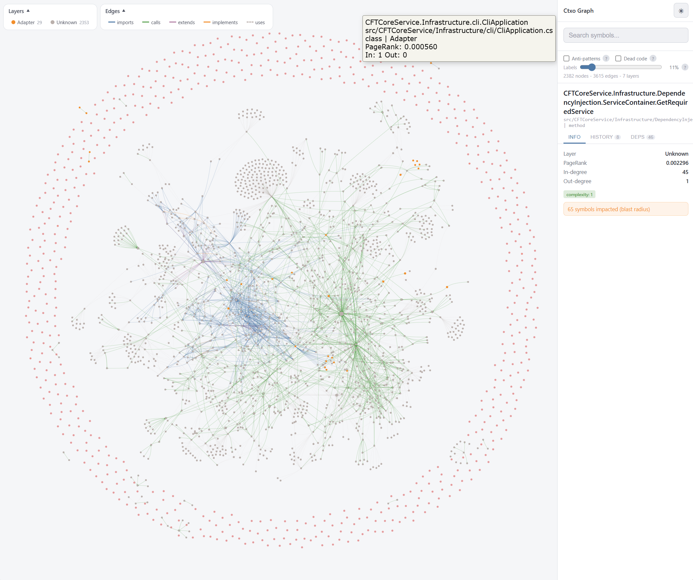

<div align="center">

[](https://www.npmjs.com/package/@ctxo/cli)
[](https://github.com/alperhankendi/Ctxo/actions/workflows/ci.yml)
[](https://github.com/alperhankendi/Ctxo/actions/workflows/release.yml)

<picture>
  <source media="(prefers-color-scheme: dark)" srcset="docs/img/hero-svg.svg">
  <source media="(prefers-color-scheme: light)" srcset="docs/img/hero-svg.svg">
  
</picture>

```Shell
npm install -g @ctxo/cli   # one-time global install (gives you the `ctxo` command)
ctxo init
ctxo index
```

<a href="https://alperhankendi.github.io/Ctxo/docs/">
  
</a>

<sub>Detects your languages, installs the right plugins, wires Ctxo into your AI client, installs git hooks, and builds the first index  one command.</sub>

</div>

***

## The Problem: agents code blind

Drop a modern coding agent into a real repo. It ripgreps a symbol, gets 47 hits, reads five files to find the definition, five more for callers  **misses the subclass entirely** (inheritance doesn't show up in text search), **never checks git history** (and confidently reintroduces a bug that was reverted three weeks ago), then runs out of context and starts hallucinating.

It's not a skill gap. It's a **sensory gap**. The agent is navigating your codebase with its eyes closed and a phone book.

## The Solution: proactive, not reactive

The core shift: your agent stops reacting to files it stumbles into and starts planning from a complete map. **Blast radius before the edit. Git intent before the bug fix. Importer list before the rename.**

Ctxo indexes your repo once kept fresh by file watchers and git hooks into a deterministic graph: every symbol, every edge (imports, calls, extends, implements), every relevant git commit with intent classified, every anti-pattern. All exposed through 14 semantic MCP tools.

One `get_blast_radius` call replaces an entire ripgrep/read spiral. One `get_pr_impact` replaces a full review session of "wait, what calls this?"

The agent still writes the code. It just stops writing it **blind** so the bug never has to be caught by the compiler, the tests, CI, or a user.

## Codebase Dashboard

Full-stack analytics UI with eight views: File Tree, Heatmap, Co-Changes, Timeline, Architecture, MCP Explorer, and Diff. Deployed to GitHub Pages on every push.


[Open Dashboard](https://alperhankendi.github.io/Ctxo/ctxo-visualizer.html)

## Dependency Graph

`ctxo visualize` generates a self-contained HTML from your `.ctxo/` index. Interactive force-directed graph with PageRank sizing, layer coloring, blast radius on click, and dark/light theme.



[Open Dependency Graph](https://alperhankendi.github.io/Ctxo/visualize.html)

## Safe-Edit Guard

AI agents don't fail because they can't code. They fail because they code blind. Ctxo gives them the full picture before they write a single line.

The problem: an agent opens a file, makes a targeted edit, and walks away. It never checked what else depends on that symbol. Downstream callers silently break. Tests pass because the agent only ran the ones in the same file.

The safe-edit guard closes this loop deterministically. When you run `ctxo init`, it:

1. Registers a **PreToolUse hook** in `.claude/settings.json` (Claude Code) that intercepts every Edit call.
2. Installs three **model-invoked skills** (`ctxo-understand`, `ctxo-safe-edit`, `ctxo-review-pr`) so the agent knows when to check blast radius, history, and PR risk.

If an agent tries to edit a high-impact symbol without first calling `get_blast_radius`, the hook blocks the edit and tells the agent what to check. Once the agent runs the tool, the edit goes through normally. Fires once per symbol per session, fail-open on any uncertainty.

**Tune it:**

```shell
# Preview which symbols the guard would flag at current sensitivity
ctxo gate --preview

# Check blast radius for a specific symbol (pipe to jq, CI scripts, etc.)
ctxo blast-radius "src/core/graph.ts::buildGraph::function" --json
```

Configure sensitivity in `.ctxo/config.yaml`:

```yaml
gate:
  enabled: true
  sensitivity: balanced   # strict | balanced (DEFAULT) | lenient
```

**Platform matrix:**

| Platform | Hook enforcement | Skills | Rules |
|---|---|---|---|
| Claude Code | yes (PreToolUse blocks) | yes | yes |
| Cursor | no (no blocking pre-edit hook) | yes | yes |
| Other | no | where supported | yes |

## Links

* [Docs](https://alperhankendi.github.io/Ctxo/docs/)  quick start, MCP tools, CLI reference, integrations
* [npm](https://www.npmjs.com/package/@ctxo/cli)
* [Changelog](CHANGELOG.md)
* [LLM Reference](llms-full.txt)

## License

MIT
