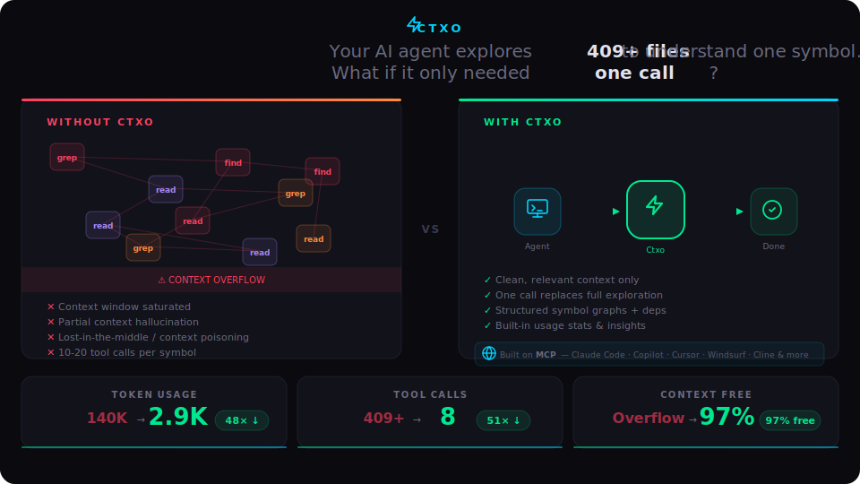
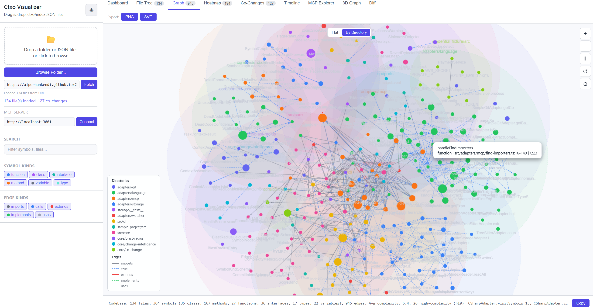
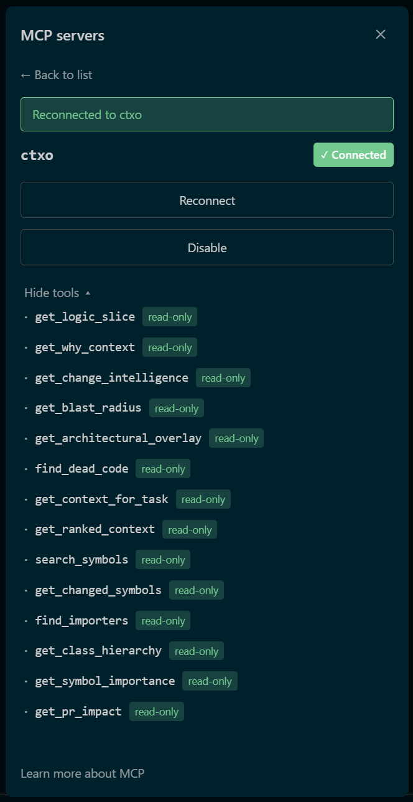

<div align="center">

[](https://www.npmjs.com/package/ctxo-mcp)
[](https://github.com/alperhankendi/Ctxo/actions/workflows/ci.yml)
[](https://github.com/alperhankendi/Ctxo/actions/workflows/release.yml)

**Code intelligence for AI agents one call instead of hundreds.**

<picture>
  <source media="(prefers-color-scheme: dark)" srcset="docs/img/hero-svg.svg">
  <source media="(prefers-color-scheme: light)" srcset="docs/img/hero-svg.svg">
  
</picture>

</div>

***

### The Problem

AI coding assistants like Copilot, Claude Code, and Cursor rely on generic tools  `grep`, `find`, file reads to understand your codebase. On brownfield projects with thousands of files, this brute-force exploration creates a chain of problems:

* **Context window saturation** The agent fills its window reading files one by one, leaving little room for actual reasoning
* **Partial context hallucination** It sees a function but misses its dependencies, leading to wrong assumptions and broken suggestions
* **Lost-in-the-middle** Critical information buried deep in a long context gets ignored by the model
* **Context poisoning** Irrelevant code pulled in during exploration biases the model's output
* **Iteration overhead** Understanding one symbol takes 10-20 tool calls, each adding more noise to the context
* **Stale reasoning** After too many iterations, the agent contradicts its own earlier assumptions

The result: more tokens burned, slower responses, higher cost, and lower quality output.

### The Solution

Ctxo is an **MCP server** that **enhances** your existing AI tools with dependency-aware, history-enriched code intelligence. Instead of hundreds of `grep` and `read_file` calls, your agent gets the full picture symbol graphs, blast radius, git intent, and risk scores in a **single MCP call**.

* **Clean context** Only relevant symbols and their transitive dependencies, nothing more
* **Fewer iterations** One call replaces an entire exploration cycle
* **Higher quality** The agent reasons over structured, complete context instead of fragmented file reads

> A senior developer takes \~10 minutes to gather context across files. Ctxo delivers that same context in **under 500ms**.

## Quick Start

One command sets up everything — index directory, MCP server registration, AI tool rules, and git hooks:

```Shell
npx ctxo-mcp init
```

That's it. The interactive wizard detects your AI tools, registers the ctxo MCP server in the correct config file (`.mcp.json`, `.vscode/mcp.json`, etc.), and generates usage rules so your assistant knows when to call each tool.

<details>
<summary>Manual MCP config (if not using <code>ctxo init</code>)</summary>

**Claude Code / Cursor / Windsurf / Augment / Antigravity** — `.mcp.json`:

```JSON
{ "mcpServers": { "ctxo": { "command": "npx", "args": ["-y", "ctxo-mcp"] } } }
```

**VS Code (Copilot)** — `.vscode/mcp.json`:

```JSON
{ "servers": { "ctxo": { "type": "stdio", "command": "npx", "args": ["-y", "ctxo-mcp"] } } }
```

**Amazon Q** — `.amazonq/mcp.json`:

```JSON
{ "mcpServers": { "ctxo": { "command": "npx", "args": ["-y", "ctxo-mcp"] } } }
```

**Zed** — `settings.json`:

```JSON
{ "context_servers": { "ctxo": { "command": { "path": "npx", "args": ["-y", "ctxo-mcp"] } } } }
```

</details>

## 14 Tools

| Tool                        | What it does                                                                             |
| --------------------------- | ---------------------------------------------------------------------------------------- |
| `get_logic_slice`           | Symbol + transitive dependencies (L1-L4 progressive detail)                              |
| `get_blast_radius`          | What breaks if this changes (3-tier: confirmed/likely/potential)                         |
| `get_architectural_overlay` | Project layer map (Domain/Infrastructure/Adapter)                                        |
| `get_why_context`           | Git commit intent + anti-pattern warnings (reverts, rollbacks)                           |
| `get_change_intelligence`   | Complexity x churn composite score                                                       |
| `find_dead_code`            | Unreachable symbols, unused exports, scaffolding markers                                 |
| `get_context_for_task`      | Task-optimized context (fix/extend/refactor/understand)                                  |
| `get_ranked_context`        | Two-phase BM25 search (camelCase-aware, fuzzy correction) + PageRank within token budget |
| `search_symbols`            | Symbol name/regex search across index (`mode: 'fts'` for BM25)                           |
| `get_changed_symbols`       | Symbols in recently changed files (git diff)                                             |
| `find_importers`            | Reverse dependency lookup ("who uses this?")                                             |
| `get_class_hierarchy`       | Class inheritance tree (ancestors + descendants)                                         |
| `get_symbol_importance`     | PageRank centrality ranking                                                              |
| `get_pr_impact`             | Full PR risk assessment in a single call                                                 |

## Tool Selection Guide

```
Reviewing a PR?           → get_pr_impact
About to modify code?     → get_blast_radius → get_why_context
Understanding a symbol?   → get_context_for_task(taskType: "understand")
Fixing a bug?             → get_context_for_task(taskType: "fix")
Refactoring?              → get_context_for_task(taskType: "refactor")
Don't know the name?      → search_symbols or get_ranked_context
Finding unused code?      → find_dead_code
Safe to delete?           → find_importers
Onboarding?               → get_architectural_overlay → get_symbol_importance
```

## CLI Commands

```Shell
# Setup
npx ctxo-mcp init                          # Interactive setup (index, AI tool rules, git hooks)
npx ctxo-mcp init --tools claude-code,cursor -y  # Non-interactive setup
npx ctxo-mcp init --rules                  # Regenerate AI tool rules only
npx ctxo-mcp init --dry-run                # Preview what would be created

# Indexing
npx ctxo-mcp index                         # Build full codebase index
npx ctxo-mcp index --check                 # CI gate: fail if index stale
npx ctxo-mcp index --skip-history          # Fast re-index without git history
npx ctxo-mcp watch                         # File watcher for incremental re-index
npx ctxo-mcp sync                          # Rebuild SQLite cache from committed JSON

# Diagnostics
npx ctxo-mcp status                        # Show index manifest
npx ctxo-mcp doctor                        # Health check all subsystems (--json, --quiet)
npx ctxo-mcp stats                         # Show usage statistics (--json, --days N, --clear)
```

**Example output:**

```
npx ctxo-mcp stats

  Usage Summary (all time)
  ────────────────────────────────────────
  Total tool calls:      30
  Total tokens served:   26.0K

  Top Tools
  ────────────────────────────────────────
  get_logic_slice         14 calls      avg 352 tokens
  get_blast_radius        3 calls       avg 1,279 tokens
  get_ranked_context      3 calls       avg 898 tokens
  find_importers          2 calls       avg 1,342 tokens
  get_context_for_task    2 calls       avg 740 tokens

  Top Queried Symbols
  ────────────────────────────────────────
  SymbolNode                      15 queries
  LogicSliceQuery                 4 queries
  SqliteStorageAdapter            2 queries

  Detail Level Distribution
  ────────────────────────────────────────
  L1: ███░░░░░░░   25%
  L2: ███░░░░░░░   25%
  L3: ███░░░░░░░   25%
  L4: ███░░░░░░░   25%
```

## Features

**Response Envelope** All responses include `_meta` with item counts, truncation info, and drill-in hints. Large results auto-truncated at 8KB (configurable via `CTXO_RESPONSE_LIMIT`).

**Intent Filtering** 4 tools accept `intent` parameter for keyword-based result filtering. `get_blast_radius(symbolId, intent: "test")` returns only test-related impacts.

**Tool Annotations** All tools declare `readOnlyHint: true`, `idempotentHint: true`, `openWorldHint: false` for safe auto-approval in agent frameworks.

**Privacy Masking** AWS keys, GCP service accounts, Azure connection strings, JWTs, private IPs, env secrets automatically redacted. Extensible via `.ctxo/masking.json`.

**Debug Mode** `DEBUG=ctxo:*` for all debug output, or `DEBUG=ctxo:git,ctxo:storage` for specific namespaces.

**Per-tool savings vs manual approach:**

```
                        Manual Tokens   Ctxo Tokens   Savings
get_logic_slice         ████████ 1,950  █ 150         92%
get_blast_radius        ███ 800         ██ 600        25%
get_overlay             ████████████ 25K██ 500        98%
get_why_context         █ 200           █ 200          0%
get_change_intelligence ████████ 2,100  ▏ 50          98%
find_dead_code          █████████ 5,000 ████ 2,000    60%
────────────────────────────────────────────────────────────
TOTAL                   35,050 tokens   3,500 tokens  90%
                        329+ calls      6 calls       98%
```

## Agentic AI Usage

**Claude Agent SDK:**

```TypeScript
import { query } from "@anthropic-ai/claude-agent-sdk";

for await (const message of query({
  prompt: "Analyze the blast radius of AuthService",
  options: {
    mcpServers: { ctxo: { command: "npx", args: ["-y", "ctxo-mcp"] } },
    allowedTools: ["mcp__ctxo__*"]
  }
})) { /* ... */ }
```

**OpenAI Agents SDK:**

```Python
from agents import Agent, Runner
from agents.mcp import MCPServerStdio

async with MCPServerStdio(params={"command": "npx", "args": ["ctxo-mcp"]}) as ctxo:
    agent = Agent(name="Reviewer", mcp_servers=[ctxo])
    result = await Runner.run(agent, "Review the PR impact")
```

See [Agentic AI Integration Guide](docs/agentic-ai-integration.md) for LangChain, raw MCP client, and CI/CD examples.

## Multi-Language Support

| Language              | Parser      | Tier   | Features                                                         |
| --------------------- | ----------- | ------ | ---------------------------------------------------------------- |
| TypeScript/JavaScript | ts-morph    | Full   | Type-aware resolution, cross-file imports, `this.method()` calls |
| Go                    | tree-sitter | Syntax | Structs, interfaces, functions, methods, import edges            |
| C#                    | tree-sitter | Syntax | Classes, interfaces, methods, enums, namespace qualification     |

## Index Visualizer

Ctxo ships with an interactive visualizer that renders your codebase index as a dependency graph. Explore symbols, edges, layers, and PageRank scores visually deployed automatically to GitHub Pages on every push.



[Open Live Visualizer](https://alperhankendi.github.io/Ctxo/ctxo-visualizer.html)

## How It Works



Ctxo builds a **committed JSON index** (`.ctxo/index/`) that captures symbols, dependency edges, git history, and co-change data. The MCP server reads this index to answer queries no runtime parsing, no external services.

```
.ctxo/
  index/          ← committed (per-file JSON, reviewable in PRs)
  .cache/         ← gitignored (local SQLite, auto-rebuilt)
  config.yaml     ← committed (team settings)
  masking.json    ← committed (custom masking patterns)
```

## Links

* [npm](https://www.npmjs.com/package/ctxo-mcp)
* [Changelog](CHANGELOG.md)
* [LLM Reference](llms-full.txt)
* [MCP Validation Runbook](docs/runbook/mcp-validation/mcp-validation.md)
* [CLI Validation Runbook](docs/runbook/cli-validation/cli-validation.md)
* [Architecture](docs/artifacts/architecture.md)
* [PRD](docs/artifacts/prd.md)

## License

MIT
